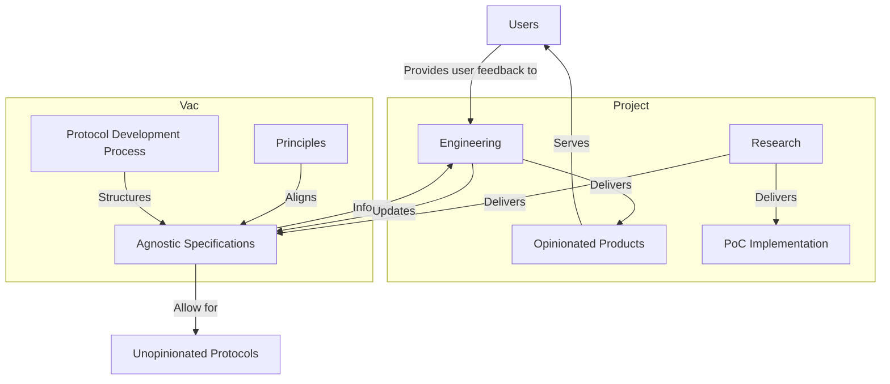

#

## Mermaid

See [mdx-mermaid](https://www.npmjs.com/package/mdx-mermaid).

## Example 1:

## Example 2:

import { Mermaid } from 'mdx-mermaid/Mermaid'

<Mermaid
  chart={`sequenceDiagram
    participant Alice
    participant Bob
    Alice->>John: Hello John, how are you?
    loop Healthcheck
        John->>John: Fight against hypochondria
    end
    Note right of John: Rational thoughts  prevail!
    John-->>Alice: Great!
    John->>Bob: How about you?
    Bob-->>John: Jolly good!`}
/>
